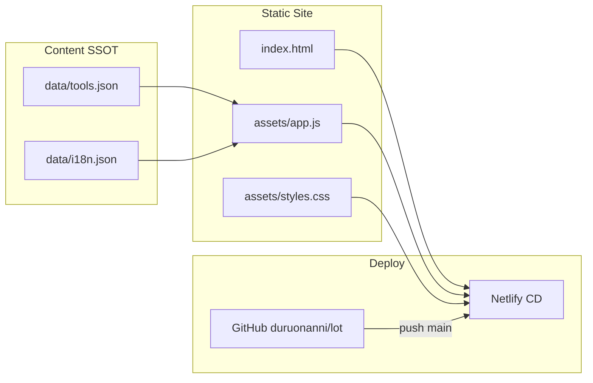
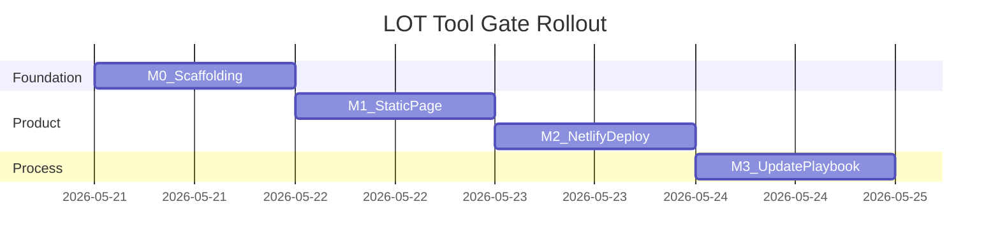

# LGFS LOT AI Tool Gate — Rollout Plan

Status: Active (M0–M1 implemented; M2 Netlify connection pending)  
Last updated: 2026-05-21  
Project type: enterprise

---

## Context

- **Repo:** [duruonanni/lot](https://github.com/duruonanni/lot) — `git init` complete; `main` pushed with bootstrap `README.md` / `.gitignore`
- **Visual baseline:** Studio [LENOVO_ENTERPRISE_DASHBOARD_TEMPLATE.html](../../../04_RESOURCES/TEMPLATES/LENOVO_ENTERPRISE_DASHBOARD_TEMPLATE.html) + [html_dashboard_lenovo_theme.md](../../../04_RESOURCES/UI_THEMES/html_dashboard_lenovo_theme.md)
- **Deploy reference:** lightweight static site (similar to `LGFSPricing_Project/netlify.toml`); **no Netlify Functions** in M1
- **M1 seed tool:** Lenovo EaaS Invoice Validator — `https://invoice-extractor-tool.netlify.app` (see `codex_invoice_extractor_tool/SESSION_HANDOFF.md`)
- **Access strategy:** public-first; architecture leaves room for optional Netlify Identity gate later (see `codex_invoice_extractor_tool/docs/HOSTED_ROLLOUT_PLAN.md` §4); not implemented in M1

---

## Goals

| Goal | M1 | Later |
|------|----|-------|
| Bilingual directory page (default English) | Yes | — |
| Showcase AI tools built by DT for LGFS LOT | 1 real entry | User adds entries over time |
| Netlify auto-deploy | Yes | — |
| Repeatable AI content updates | Schema + playbook | Bulk import |
| Lenovo enterprise visual style | Yes | — |
| Login protection | No | Optional M4 |

---

## Architecture



**Core principle:** Tool metadata lives in `data/tools.json`, not hard-coded in HTML. The page fetches same-origin JSON at runtime. Future AI iterations edit JSON + push — no layout changes required.

**Version SSOT:** `package.json` `"version"`; footer synced via build script (see Studio `RELEASE_VERSIONING.md`).

---

## Target Repository Layout

```text
LGFS_LOT_Project/
├── docs/
│   └── ROLLOUT_PLAN.md          ← this document
├── data/
│   ├── tools.json               ← tool catalog SSOT
│   └── i18n.json                ← page shell copy (hero, buttons, empty states)
├── assets/
│   ├── styles.css               ← Lenovo template tokens + card grid
│   └── app.js                   ← i18n toggle, render, search
├── index.html
├── netlify.toml
├── package.json
├── scripts/
│   └── sync_version.mjs         ← patch bump + sync footer version
├── PRODUCT_REQUIREMENTS.md
├── DECISIONS.md
├── SESSION_HANDOFF.md
└── README.md
```

---

## Page Design (M1)

Structure: **Hero → KPI → Category tabs → Tool cards** (card grid instead of table — better for a tool directory).

| Section | EN (default) | ZH |
|---------|--------------|-----|
| Hero title | LGFS LOT AI Tool Gate | LGFS LOT AI 工具导览 |
| Hero subtitle | AI tools built by DT for the LGFS LOT team | DT 团队为 LGFS LOT 团队开发的 AI 工具入口 |
| Language toggle | EN \| 中文 | Top-right; persisted in `localStorage`; **first visit defaults to `en`** |
| KPI row | Tool count / Categories / Last updated | Chinese equivalents |
| Tool card | Name, short desc, tags, **Open tool** CTA | Same fields via `name.zh` / `summary.zh` |
| Footer | Version + “Lenovo-inspired enterprise style” disclaimer | Bilingual |

**Typography:** `"Noto Sans", "Helvetica Neue", …` (CJK support per theme doc)

**M1 seed entry — Invoice Extractor:**

```json
{
  "id": "invoice-extractor",
  "category": "validation",
  "status": "ga",
  "url": "https://invoice-extractor-tool.netlify.app",
  "owner": "DT",
  "name": { "en": "Lenovo EaaS Invoice Validator", "zh": "联想 EaaS 发票校验工具" },
  "summary": {
    "en": "Browser-local PDF invoice validation and Excel export for EaaS statements.",
    "zh": "在浏览器本地校验 EaaS 发票 PDF 并导出 Excel。"
  },
  "tags": ["pdf", "validation", "offline-capable"]
}
```

---

## Data Schema (`tools.json`)

```json
{
  "meta": {
    "lastUpdated": "2026-05-21",
    "maintainer": "DT"
  },
  "tools": []
}
```

**ToolEntry fields:**

| Field | Required | Notes |
|-------|----------|-------|
| `id` | yes | kebab-case, unique |
| `name.en` / `name.zh` | yes | |
| `summary.en` / `summary.zh` | yes | 1–2 sentences |
| `url` | yes | External link; opens in new tab |
| `category` | yes | `validation` \| `extraction` \| `analysis` \| `automation` \| `other` |
| `status` | yes | `pilot` \| `ga` \| `deprecated` |
| `owner` | no | Default `DT` |
| `tags` | no | String array |
| `docsUrl` | no | Optional documentation link |

**`i18n.json`** holds page shell strings (hero, search placeholder, status labels, CTAs) — kept separate from tool data.

---

## Netlify Deployment

`netlify.toml` (M1 minimal, no functions):

```toml
[build]
  publish = "."
  command = "npm run build"

[[headers]]
  for = "/*"
  [headers.values]
    X-Frame-Options = "DENY"
    X-Content-Type-Options = "nosniff"
```

`package.json` scripts:

- `"build"`: `node scripts/sync_version.mjs` (patch bump footer version → `assets/version.js`; skip with `LOT_SKIP_VERSION_BUMP=1`)
- `"preview"`: local static server (`npx serve .` or `python -m http.server`)

**CD flow:** push `main` → Netlify build & publish (same pattern as `codex_invoice_extractor_tool`, without Identity/DB).

**One-time manual steps (M2):**

1. [app.netlify.com](https://app.netlify.com) → Add site → Import from Git → `duruonanni/lot`
2. Build settings read from `netlify.toml` (publish `.`, command `npm run build`)
3. Record site URL (e.g. `lot-tool-gate.netlify.app`) in `SESSION_HANDOFF.md`
4. (Optional) Custom domain / team access policy

---

## Phased Delivery

### M0 — Project scaffolding (~0.5 session)

- Add enterprise project docs: `PRODUCT_REQUIREMENTS.md`, `DECISIONS.md`, `SESSION_HANDOFF.md`
- Write this document (`docs/ROLLOUT_PLAN.md`)
- Initialize `package.json` (version `0.1.0`)
- Update `README.md`: local preview, deploy, content update instructions

**Exit criteria:** Docs complete; directory structure ready; README explains next steps even before the page exists.

---

### M1 — Static bilingual page v1 (~1 session)

- Extract CSS tokens from Lenovo template → `assets/styles.css`
- Implement `index.html` + `assets/app.js`:
  - Language toggle (default `en`, persisted in `localStorage`)
  - Render from `data/tools.json` / `data/i18n.json`
  - Client-side search (name + summary + tags)
  - Category tab filter
  - Responsive tool card grid
- Seed `data/tools.json` with **Invoice Extractor**
- Local smoke test via browser or `npm run preview`

**Exit criteria:** Bilingual toggle works; Invoice Extractor card opens correct URL; empty/no-results states have copy; mobile layout is readable.

---

### M2 — Netlify go-live (~0.5 session)

- Add `netlify.toml` + build script
- Connect Netlify ↔ GitHub repo
- Verify first deploy: live URL reachable, JSON loads without 404, language toggle and search work
- Update `SESSION_HANDOFF.md` (site URL, Netlify site id, deploy verification date)

**Exit criteria:** `https://<site>.netlify.app` is publicly reachable; git push triggers auto redeploy.

---

### M3 — AI content update playbook (~0.5 session, docs-focused)

Add a fixed **“Add a tool”** workflow in this document or `README.md` for future AI sessions:

1. User provides: `name (EN/ZH)`, `url`, `summary (EN/ZH)`, `category`, `status`, optional `tags`
2. AI appends entry to `data/tools.json` (validate unique `id`, URL reachable)
3. Update `meta.lastUpdated`
4. Local preview to confirm card renders
5. User confirms → commit + push → Netlify auto-publishes

**Prompt template:**

> Add tool to LOT gate: URL=…, EN name=…, ZH name=…, EN summary=…, ZH summary=…, category=…, status=…

**Exit criteria:** Workflow documented; dry-run with a mock tool entry (need not go live).

#### Dry-run example (do not commit mock data)

Use this sample object locally to validate the add-tool workflow without publishing:

```json
{
  "id": "mock-demo-tool",
  "category": "other",
  "status": "pilot",
  "url": "https://example.com",
  "owner": "DT",
  "name": { "en": "Mock Demo Tool", "zh": "示例工具" },
  "summary": {
    "en": "Dry-run entry for validating the catalog layout.",
    "zh": "用于验证目录布局的试运行条目。"
  },
  "tags": ["demo"]
}
```

Steps: append to `tools.json` → `npm run preview` → confirm card in EN/ZH → revert mock entry before push.

---

### M4 — Optional enhancements (backlog)

Not in M1–M3 scope:

| Item | Value | Notes |
|------|-------|-------|
| Netlify Identity gate | Internal-only access | Reuse codex Identity pattern; product decision needed |
| Auto-discover tools from Studio sibling projects | Less manual maintenance | Read each project's README / SESSION_HANDOFF |
| Tool icons / screenshots | Visual recognition | `assets/tools/<id>.png` |
| Category stats dashboard | Richer KPIs | Already computable client-side |
| Custom domain | Enterprise URL | DNS + Netlify SSL |
| BE10 Belgium extractor entry | Second tool | Pending hosted/OneDrive URL confirmation |

---

## Key Decisions (record in DECISIONS.md)

1. **Static JSON over build-time embed** — lowers AI update friction; trade-off: runtime JSON fetch (same-origin, negligible latency)
2. **Public-first access** — no Identity in M1; document upgrade path in DECISIONS
3. **Card grid over table** — better UX for a tool directory
4. **Default language EN** — `<html lang="en">` + JS init `en`; Chinese via toggle
5. **semver in package.json** — footer version; `npm run build` patch bump on Netlify CD (skippable via env)

---

## Risks and Mitigations

| Risk | Mitigation |
|------|------------|
| Linked tool goes offline | `status: deprecated` + greyed card; periodic manual checks |
| EN/ZH length breaks layout | Card min-height + summary line-clamp; Noto Sans |
| Netlify GitHub auth | User authorizes repo in Netlify UI; document manual steps |
| Unofficial Lenovo branding | Footer disclaimer (theme doc AI rule) |
| Login required later | M4 Identity; M1 HTML/JS not coupled to auth |

---

## Verification Checklist (M1 + M2)

- [ ] First visit defaults to English
- [ ] Chinese toggle persists after refresh
- [ ] Invoice Extractor link opens in new tab with correct URL
- [ ] Search for "invoice" filters correctly
- [ ] Category tabs work
- [ ] Footer version matches `package.json`
- [ ] Netlify deploy log green; live site matches local
- [ ] Mobile viewport (375px) has no horizontal scroll issues

---

## Implementation Order

Execute M0 → M1 → M2 → M3. M2 requires the user to connect Git in the Netlify UI (AI can guide but cannot authorize on their behalf).


